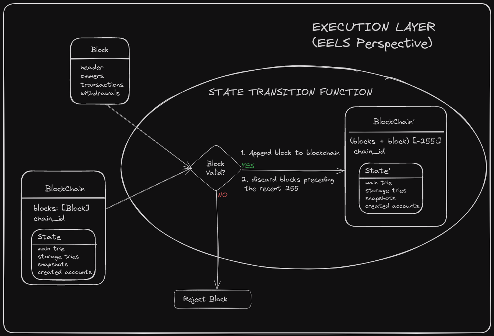
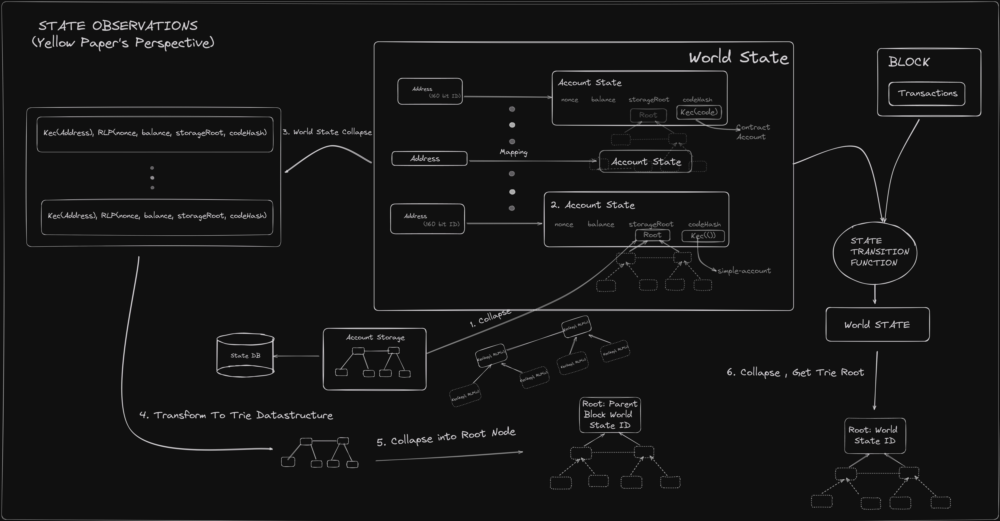

The execution layer was originally specified in the yellow paper as it encompassed the whole Ethereum. The most up to date specification is [EELS python spec](https://ethereum.github.io/execution-specs/).

> - [Yellow Paper, paris version 705168a, 2024-03-04](https://ethereum.github.io/yellowpaper/paper.pdf) (note: This is outdated does not take into account post merge updates)
> - [Python Execution Layer specification](https://ethereum.github.io/execution-specs/)
> - EIPs [Look at Readme of the repo](https://github.com/ethereum/execution-specs)

This page provides an overview of EL specification, its architecture and context for the pyspec.

## State transition function

The Execution Layer, from the EELS perspective, focuses exclusively on executing the state transition function (STF). This role addresses two primary questions[¹]:

- Is it possible to append the block to the end of the blockchain?
- How does the state change as a result?

Simplified Overview:


The image above represents the block level state transition function in the yellow-paper.

In the equation, each symbol represents a specific concept related to the blockchain state transition:

-  represents the **state of the blockchain** after applying the current block, often referred to as the "new state."
-  denotes the [block level state transition function](https://github.com/ethereum/execution-specs/blob/0f9e4345b60d36c23fffaa69f70cf9cdb975f4ba/src/ethereum/shanghai/fork.py#L145), which is responsible for transitioning the blockchain from one state to the next by applying the transactions contained in the current block.
-  represents the state of the **[blockchain](https://github.com/ethereum/execution-specs/blob/0f9e4345b60d36c23fffaa69f70cf9cdb975f4ba/src/ethereum/shanghai/fork.py#L73)** before adding the current block, also known as the "previous state."

-  symbolizes the **[current block](https://github.com/ethereum/execution-specs/blob/0f9e4345b60d36c23fffaa69f70cf9cdb975f4ba/src/ethereum/shanghai/fork_types.py#L217)** that is being sent to the execution layer for processing.

Furthermore, it's crucial to understand that  should not be confused with the `State` class defined in the Python specification. Rather than being stored in a specific location, the system's state is dynamically derived through the application of the state collapse function. This highlights the conceptual separation between the mathematical model of blockchain state transitions and the practical implementation details within software specifications.



where  extracts the gas consumed by executing transaction  in state .

---

### Commitment Verification

The ordered sequence of transaction receipts and the final world state are committed using a Merkle–Patricia Trie. The block is valid only if these computed roots match the block header:

1.  **Receipts Root:** 
2.  **State Root:** 

**Validity Requirements:**

- Computed receipts root must match the header.
- Final state root must match the header.
- Cumulative gas usage must respect the block gas limit ().

Block validity is **atomic**. The block-level transition function  maps an initial state and block to a complete block result. The block is accepted if and only if all reconstruction, execution, accumulation, and commitment checks succeed. There is no notion of partial acceptance of transactions within a block.

---

**Implementation Reference:**
The semantics described above are based on the [Ethereum Yellow Paper](https://ethereum.github.io/yellowpaper/paper.pdf):

- **Section 12:** Block Finalisation
- **Section 12.1:** Executing Withdrawals
- **Section 12.2:** Transaction Validation
- **Section 12.3:** State Validation

### Gas Accounting Examples

Up to this point, we've talked about EL post-merge gas mechanics in a variety of scenarios. Let's tie it all together with some examples.

Note: Each transaction type has distinct parameters and fee handling behavior.

### Example 1: Simple ETH Transfer

#### Supported Transaction Types

- **Type 0**: Legacy transaction
- **Type 1**: Legacy + Access List ([EIP-2930](https://eips.ethereum.org/EIPS/eip-2930))
- **Type 2**: EIP-1559 transaction ([EIP-1559](https://eips.ethereum.org/EIPS/eip-1559))

#### Transaction Parameters (Defined by Sender)

| Tx Type        | Parameter              | Description                                      |
| -------------- | ---------------------- | ------------------------------------------------ |
| Type 0 / 1 / 2 | `gasLimit`             | Max gas the transaction can consume              |
| Type 0 / 1     | `gasPrice`             | Full gas price paid to the proposer              |
| Type 2         | `maxFeePerGas`         | Max total fee per gas unit (includes base + tip) |
| Type 2         | `maxPriorityFeePerGas` | Optional tip to incentivize block inclusion      |

#### Block Parameters (Defined by Protocol)

| Tx Type | Parameter | Description                                          |
| ------- | --------- | ---------------------------------------------------- |
| Type 2  | `baseFee` | Dynamic base gas price per unit (burned by protocol) |

#### Upfront Reservation

At this point, the transaction is ready for processing within a block. Initially, an upfront amount is reserved, meaning it's deducted from the sender.
| Tx Type | Formula |
|------------|----------------------------------|
| Type 0 / 1 | `gasLimit × gasPrice` |
| Type 2 | `gasLimit × maxFeePerGas` |

#### Execution Phase

After initial deductions, the transaction's execution cost is determined and the gas is either burned, awarded to the proposer, or returned to the sender.

| Tx Type    | Effective Gas Price                                           | Actual Cost                   |
| ---------- | ------------------------------------------------------------- | ----------------------------- |
| Type 0 / 1 | `gasPrice`                                                    | `gasUsed × gasPrice`          |
| Type 2     | `baseFee + min(maxPriorityFeePerGas, maxFeePerGas − baseFee)` | `gasUsed × effectiveGasPrice` |

Note:

- For Type 0/1, the full amount is paid directly to the proposer.  
  For Type 2, the baseFee is burned and the tip, `min(maxPriorityFeePerGas, maxFeePerGas - baseFee)`, goes to the proposer. The effectiveGasPrice ensures the total gas cost stays within maxFeePerGas, potentially reducing the tip if the baseFee is high.

The refunded amount is calculated via `reserved − actualCost` and is returned to the sender.

### Example 2: Blob Transaction

Blob carrying transactions pay both the usual EVM gas fees and a separate blob gas fee for large data blobs. Note that there were no blobs for pre-EIP-1559 transaction types. In this example, we will only discuss fees associated with the blob.

#### Blob Transaction Type

- **Type 3**: EIP-4844 transaction ([EIP-4844](https://eips.ethereum.org/EIPS/eip-4844))

#### Transaction Parameters

- `blobVersionedHashes` – identifies each data blob.
- `totalBlobGas` – computed as `GasPerBlob × numberOfBlobs`.
- `maxFeePerBlobGas` – maximum gwei per blob gas unit the sender will pay.

#### Block Parameters

- `blobGasPrice` – dynamic per block blob gas unit price.

Initially, an upfront amount is reserved, meaning it's deducted from the sender.

- `reserved_blob  = totalBlobGas × maxFeePerBlobGas`

#### Execution Cost

- `blobFee = totalBlobGas × blobGasPrice` and is fully burned by the protocol.

#### Refund to Sender Calculation

- `refund_blob = reserved_blob − blobFee` and is returned to sender.

These examples should help tie together how gas is handled during a transaction lifecycle.

## Appendix

### Code A

```r
##imports

library(plotly)
library(dplyr)

## values for xi and rho
## this is how '<-' assignment works in R

ELASTICITY_MULTIPLIER <- 2
BASE_FEE_MAX_CHANGE_DENOMINATOR <- 8

## Slightly modified function from the spec

calculate_base_fee_per_gas <- function(parent_gas_limit, parent_gas_used, parent_base_fee_per_gas, max_change_denom = BASE_FEE_MAX_CHANGE_DENOMINATOR , elasticity_multiplier = ELASTICITY_MULTIPLIER) {

  #  %/% == // (in python) == floor

  parent_gas_target <- parent_gas_limit %/% elasticity_multiplier
  if (parent_gas_used == parent_gas_target) {
    expected_base_fee_per_gas <- parent_base_fee_per_gas
  } else if (parent_gas_used > parent_gas_target) {
    gas_used_delta <- parent_gas_used - parent_gas_target
    parent_fee_gas_delta <- parent_base_fee_per_gas * gas_used_delta
    target_fee_gas_delta <- parent_fee_gas_delta %/% parent_gas_target
    base_fee_per_gas_delta <- max(target_fee_gas_delta %/% max_change_denom, 1)
    expected_base_fee_per_gas <- parent_base_fee_per_gas + base_fee_per_gas_delta
  } else {
    gas_used_delta <- parent_gas_target - parent_gas_used
    parent_fee_gas_delta <- parent_base_fee_per_gas * gas_used_delta
    target_fee_gas_delta <- parent_fee_gas_delta %/% parent_gas_target
    base_fee_per_gas_delta <- target_fee_gas_delta %/% BASE_FEE_MAX_CHANGE_DENOMINATOR
    expected_base_fee_per_gas <- parent_base_fee_per_gas - base_fee_per_gas_delta
  }
  return(expected_base_fee_per_gas)
}
```

After defining the model in R, we proceed by simulating the function across a range of gasused scenarios:

```r
parent_gas_limit <- 30000  # Fixed for simplification

## lets see the effect on 100 to see the percentage effect this function has on fee
parent_base_fee_per_gas <- 100

## note gas used can not go below the minimum limit of 5k ,
## therefore we can just count from 5k to 30k by ones for complete precision

seq_parent_gas_used <- seq(5000, parent_gas_limit, by = 1) # creates a vector / column

## add the vector / column to the data frame

data <- expand.grid(parent_gas_used = seq_parent_gas_used)

## apply the function we created above and collect it in a new column

dataparent_gas_used, parent_base_fee_per_gas)
```

That's all for prep , now let's plot and observe by doing a scatter plot which will reveal any shape this function produces over a range; given the constraints.

```r
fig <- plot_ly(data, x = ~parent_gas_used, y = ~expected_base_fee, type = 'scatter', mode = 'markers')  # scatter plot

## %>% is a pipe operater from dplyr , used extensively in R codebases it's like the pipe | operator used in shell

fig <- fig %>% layout(xaxis = list(title = "Parent Gas Used"),
                      yaxis = list(title = "Expected Base Fee "))

## display the plot
fig
```

### Code B

```r

library(forcats)
library(ggplot2)
library(scales)
library(viridis)

## Initial parameters
initial_gas_limit <- 30000000
initial_base_fee <- 100
num_blocks <- 100000

## Sequence of blocks
blocks <- 1:num_blocks

max_natural_number <- 2^256

## Calculate gas limit for each block
gas_limits <- numeric(length = num_blocks)
expected_base_fee <- numeric(length = num_blocks)
gas_limits[1] <- initial_gas_limit
expected_base_fee[1] <- initial_base_fee

for (i in 2:num_blocks) {

   # apply max change to gas_limit at each block
    gas_limits[i] <- gas_limits[i-1] + gas_limits[i-1] %/% 1024

  # Check if the previous expected_base_fee has already reached the threshold
  if (expected_base_fee[i-1] >= max_natural_number) {
    # Once max_natural_number is reached or exceeded, stop increasing expected_base_fee
    expected_base_fee[i] <- expected_base_fee[i-1]
  } else {
    # Calculate expected_base_fee normally until the threshold is reached
    expected_base_fee[i] <- calculate_base_fee_per_gas(gas_limits[i-1], gas_limits[i], expected_base_fee[i-1])
  }
}

## Create data frame for plotting
data <- data.frame(Block = blocks, GasLimit = gas_limits, BaseFee = expected_base_fee)

## Saner labels
label_custom <- function(labels) {
  sapply(labels, function(label) {
    if (is.na(label)) {
      return(NA)
    }
    if (label >= 1e46) {
      paste(format(round(label / 1e46, 2), nsmall = 2), "× 10^46", sep = "")
    } else if (label >= 1e12) {
      paste(format(round(label / 1e12, 2), nsmall = 2), "T", sep = "")  # Trillions
    } else if (label >= 1e9) {
      paste(format(round(label / 1e9, 1), nsmall = 1), "Billion", sep = "")  # Million
    } else if (label >= 1e6) {
      paste(format(round(label / 1e6, 1), nsmall = 1), "Mil", sep = "")  # Million
    } else if (label >= 1e3) {
      paste(format(round(label / 1e3, 1), nsmall = 1), "k", sep = "")  # Thousand
    } else {
      as.character(label)
    }
  })
}

## Bin the ranges we want to observe
data_ranges <- data %>%
  mutate(Range = case_when(
    Block <= 1000 ~ "1-1000",
    Block <= 10000 ~ "1001-10000",
    Block <= 100000 ~ "10001-100000"
  ))

## Rearrange the bins to control where the plots are displayed
data_rangesRange, "1-1000", "1001-10000", "10001-100000")

## Grammar of graphics we can just + the features we want in the plot
plot <- ggplot(data_ranges, aes(x = Block, y = GasLimit, color = BaseFee)) +
  geom_line() +
  facet_wrap(~Range, scales = "free") +  # Using free to allow each facet to have its own x-axis scale
  labs(title = "Gas Limit Over Different Block Ranges",
       x = "Block Number",
       y = "Gas Limit") +
  scale_x_continuous(labels = label_custom) +  # Use custom label function for x-axis
  scale_y_continuous(labels = label_custom) +  # Use custom label function for y-axis
  scale_color_gradientn(colors = viridis(8), trans = "log10",
                        breaks = c(1e3, 1e10, 1e20, 1e40, 1e60, 1e76),
                        labels = c("100", "10^10", "10^20", "10^40", "10^60", "10^76")) +
  theme_bw()

## To view
plot

## Save to file
ggsave("plot_gas_limit.png", plot, width = 7, height = 5)

```

### Code C

```r
## we are observing the effects of this parameter
## it's set at 8 but lets see its effect in the range of [2,4, .. ,8, .. ,12]
seq_max_change_denom <- seq(2, 12, by = 2)

parent_gas_limit <- 3 * 10^6
seq_parent_gas_used <- seq(5000, parent_gas_limit, by = 100)

parent_base_fee_per_gas <- 100

data <- expand.grid( parent_gas_used = seq_parent_gas_used, base_fee_max_change_denominator = seq_max_change_denom)

dataparent_gas_used, parent_base_fee_per_gas, data$base_fee_max_change_denominator)
```

That's all for data prep , now lets plot:

```r
plot <- ggplot(data, aes(x = parent_gas_used, y = expected_base_fee, color = as.factor(base_fee_max_change_denominator))) +
    geom_point() +
    scale_color_brewer(palette = "Spectral") +
    theme_minimal() +
    labs(color = "Base Fee Max Change Denominator") +
    theme_bw()

plot
```

### Code D

```r
seq_elasticity_multiplier <- seq(1, 6, by = 1)
seq_max_change_denom <- seq(2, 12, by = 2)

parent_gas_limit <- 3 * 10^6
seq_parent_gas_used <- seq(5000, parent_gas_limit, by = 500)

parent_base_fee_per_gas <- 100

data <- expand.grid( parent_gas_used = seq_parent_gas_used, base_fee_max_change_denominator = seq_max_change_denom, elasticity_multiplier = seq_elasticity_multiplier)

dataparent_gas_used, parent_base_fee_per_gas, dataelasticity_multiplier)

plot <- ggplot(data, aes(x = parent_gas_used, y = expected_base_fee, color = as.factor(base_fee_max_change_denominator))) +
    geom_point() +
    facet_wrap(~elasticity_multiplier) +  #  we break the plots out by the this facet
    scale_color_brewer(palette = "Spectral") +
    theme_minimal() +
    labs(color = "Base Fee Max Change Denominator") +
    theme_bw()

ggsave("rho-xi.png", plot, width = 14, height = 10)
```

### Code E

```r
library(ggplot2)
library(tidyr)

## fake exponential or taylor series expansion function
fake_exponential <- function(factor, numerator, denominator) {
    i <- 1
    output <- 0
    numerator_accum <- factor * denominator
    while(numerator_accum > 0){
      output <- output + numerator_accum
      numerator_accum <- (numerator_accum * numerator) %/% (denominator * i)
      i <- i + 1
    }
    output %/% denominator
}

## Blob Gas Target
target_blob_gas_per_block <- 393216

## Blob Gas Max Limit
max_blob_gas_per_block <- 786432

 # Used in header Verificaton
 calc_excess_blob_gas <- function(parent_excess_blob_gas, parent_gas_used) {
   if (parent_gas_used  + parent_excess_blob_gas < target_blob_gas_per_block) {
     return(0)
   } else {
     return(parent_excess_blob_gas + parent_gas_used - target_blob_gas_per_block)
   }
 }

## This is how EL determines the Blob Gas Price
cancun_blob_gas_price <- function(excess_blob_gas) {
  fake_exponential(1, excess_blob_gas, 3338477)
}

## we got from zero to Max each step increasing by 1000
parent_gas_used <- seq(0, max_blob_gas_per_block, by = 1000)
## A column of the same Length
excess_blob_gas <- numeric(length = length(parent_gas_used))
excess_blob_gas[1] <- 0

## We get the T+1(time + 1) excess gas by using values from before
for (i in 2:length(parent_gas_used)) {
  excess_blob_gas[i] <- calc_excess_blob_gas(excess_blob_gas[i - 1],
                                             parent_gas_used[i - 1])
}

data_blob_price <- expand.grid(parent_gas_used = parent_gas_used)
data_blob_price$excess_blob_gas <- excess_blob_gas

## Apply the EL gas price function
data_blob_price$blob_gas_price <- mapply(cancun_blob_gas_price,
                                         data_blob_price$excess_blob_gas)

## Each row represents a block
data_blob_priceparent_gas_used)

## we collapse the 3 columns into 1 Parameter Column
data_long <- pivot_longer(data_blob_price,
                          cols = c(parent_gas_used,
                                   excess_blob_gas,
                                   blob_gas_price),
                          names_to = "Parameter",
                          values_to = "Value")

ggplot(data_long, aes(x = BlockNumber, y = Value)) +
  geom_line() +
  facet_wrap(~ Parameter, scales = "free_y") +   # We break the charts out based on the Parameter Column
  theme_minimal() +
  scale_y_continuous(labels = scales::label_number()) +
  labs(title = "Dynamic Trends in Blob Gas Consumption & Price Over Time",
       x = "Block Number",
       y = "Parameter Value") +
  geom_text(data = subset(data_long, Parameter == "blob_gas_price" &
                            BlockNumber == min(BlockNumber)),
            aes(label = "blobGasPrice = 1", y = 0),
            vjust = -1, hjust = -0.1, size = 3)
```

### Code F

```r
normalize <- function(x) {
  return((x - min(x)) / (max(x) - min(x)))
}

data_blob_priceparent_gas_used)
data_blob_priceexcess_blob_gas)
data_blob_priceblob_gas_price)

ggplot(data_blob_price, aes(x = BlockNumber)) +
  geom_line(aes(y = parent_gas_used_normalized, color = "Parent Gas Used")) +
  geom_line(aes(y = excess_blob_gas_normalized, color = "Excess Blob Gas")) +
  geom_line(aes(y = blob_gas_price_normalized, color = "Blob Gas Price")) +
  theme_minimal() +
  labs(title = "Normalized Trends Over Blocks", x = "Block Number", y = "Normalized Value", color = "Parameter")
```

### Code for formatting document

Formatting are messing up the latex code in this document the below script formats katex documents correctly.

```r
#!/bin/bash

sed -i.bck -E ':a;N;\]+)\/```code2 \1```/g; s/\]+)\1
prettier --write $1
sed -i -E ':a;N;\1\1
sed -i -E ':a;N;\\1
sed -i -E ':a;N;\1\1
sed -i -E ':a;N;\\1
sed -i -E 's/(\]+?)\s*(\1
```

### Resources

- https://archive.devcon.org/archive/watch/6/eels-the-future-of-execution-layer-specifications/?tab=YouTube
- [EIP‑1559](https://eips.ethereum.org/EIPS/eip-1559) • [archived](https://web.archive.org/web/20230101000000/https://eips.ethereum.org/EIPS/eip-1559)
- [EIP‑4844](https://eips.ethereum.org/EIPS/eip-4844) • [archived](https://web.archive.org/web/20230701000000/https://eips.ethereum.org/EIPS/eip-4844)
- [Yellow Paper](https://ethereum.github.io/yellowpaper/paper.pdf) • [archived](https://web.archive.org/web/20240310000000/https://ethereum.github.io/yellowpaper/paper.pdf)
- [EL Specs](https://github.com/ethereum/execution-specs) • [archived](https://web.archive.org/web/20240501000000/https://github.com/ethereum/execution-specs)


<Callout>
All the topics in this PR are open for collaboration on a separate branch
</Callout>
