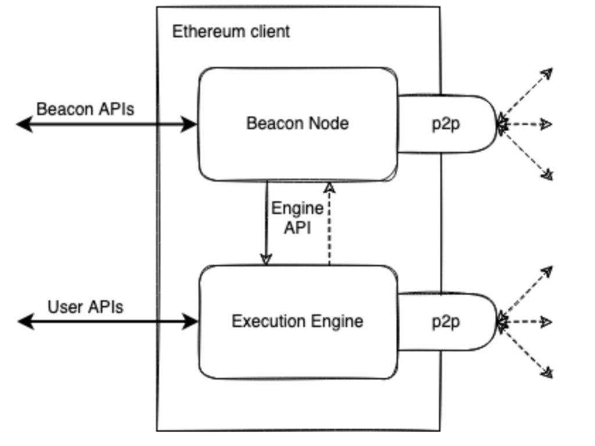

<Callout type="warn">This article is a [stub](https://en.wikipedia.org/wiki/Wikipedia:Stub), help the wiki by [contributing](/contributing.md) and expanding it.</Callout>

The current protocol architecture is a result of years of evolution. The protocol consists of two main parts – the execution layer and the consensus layer. The execution layer (EL) handles the actual transactions and user interactions, it's where the global computer executes its programs. The consensus layer (CL) provides the proof-of-stake consensus mechanism - a cryptoeconomic security mechanism that ensures all nodes follow the same tip and drive the canonical chain of the execution layer. 

In practice, these layers are implemented in their own clients connected via API. Each have its own p2p network handling different kinds of data. 

Looking under the hood of each client, they consist of many fundamental functions: 

